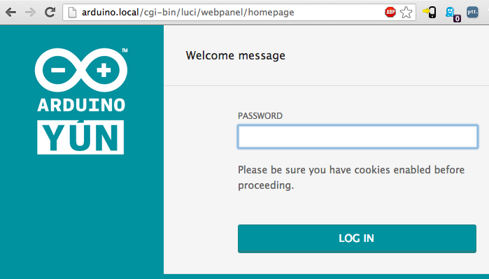
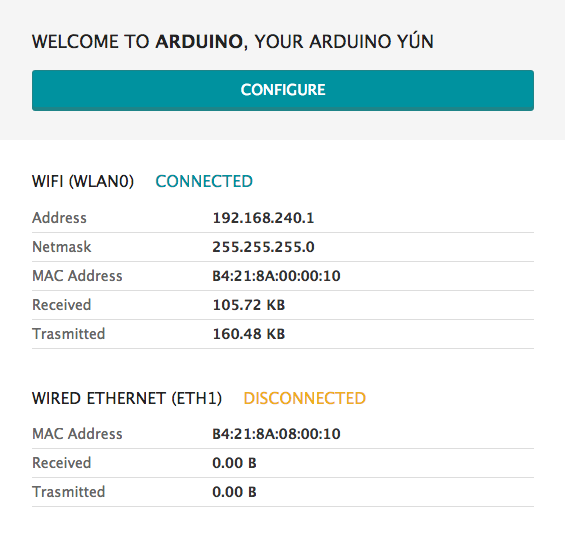
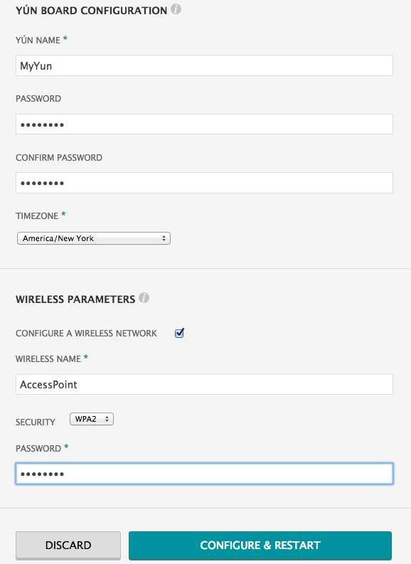
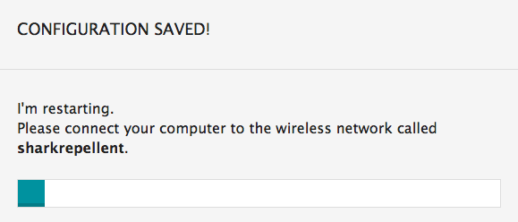
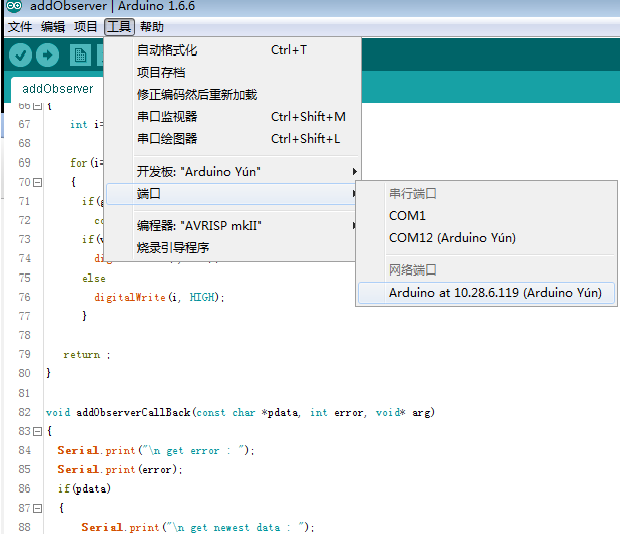
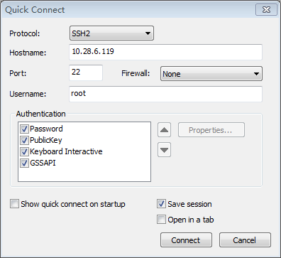
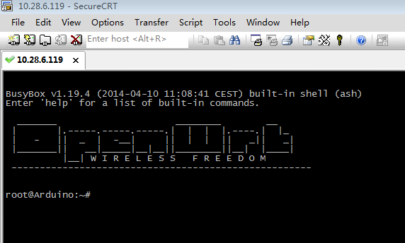
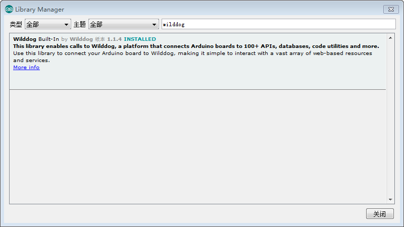

## 简介
`wilddog-client-arduino` 是wilddog在`arduino`上的实现库，通过该库，Arduino Yun可以轻松访问和同步云端数据。目前`wilddog-client-arduino` 仅支持Arduino Yun，用户向`wilddog`云发送的请求是通过Arduino Yun的联网模块ar9331转发到云端的，我们的库有两部分，如下：

	├── lib
	├── platform

	`lib`:Arduino IDE中的库，包含库代码、供用户调用的接口及示例.
	`platform`:不同平台下的实现，在Arduino Yun中为守护进程及依赖库的ipk安装文件.

## 使用步骤
	
###第一步 创建账号和应用

首先[**注册**](https://www.wilddog.com/account/signup)并登录Wilddog账号，进入控制面板。在控制面板中，添加一个新的应用。

你会获得一个独一无二的应用`URL` `https://<appId>.wilddogio.com/`，在同步和存取数据的时候，你的数据将保存在这个`URL`下。

###第二步 安装

####1、配置ArduinoYun

对出厂状态下的Arduino Yun进行配置，如果之前已经有过配置，可以略过这一步。

#####连接网络

出厂时，Arduino Yun默认为Ap模式，你需要用电脑或者手机通过wifi连接你的Arduino Yun。其ssid名字的格式为`ArduinoYun-XXXXXXXXXXXX`，
打开浏览器，在地址栏输入`http://arduino.local`或者`192.168.240.1`，按下`Enter`后会看到以下网页。

登录密码框中输入`arduino`（ArduinoYun默认登录密码为`arduino`），点击`LOG IN`进入以下页面，该页面展示Arduino Yun当前的网络信息。

点击`CONFIGURE`进入配置页面，如下

在`WIRELESS NAME` 中输入你想要的连接的wifi名称，`SECURITY` 中选择加密方式，`PASSWORD`中输入wifi密码，点击`CONFIGURE & RESTART`,Arduino Yun会自动重启并连接你所配置的网络。

	
#####获取ArduinoYun的IP

利用`SSH`登录Arduino Yun需要获取Arduino Yun的IP，可以直接登录路由获取，也可以用`Arduino 1.6.6`或者以上版本的IDE获取。将Arduino Yun保持上电，打开`Arduino IDE`，选择`工具-->端口`如下图：

	
#####SSH登录ArduinoYun

`SecureCRT`自带文件传输工具，这里以`SecureCRT`为例。打开`SecureCRT`，选择`file-->Quick Connect`，在`Hostname`框中输入Arduino Yun的IP，`name`输入`root`，如下图：

点击`Connect`后弹出下图，输入密码登录`arduino`（默认），进入以下界面说明`SSH`登录成功。

####2、安装Wilddog库

#####在联网模块中安装守护进程及依赖库

	root@Arduino:~# opkg update
	root@Arduino:~# opkg install lrzsz
	root@Arduino:~# rz	（在弹出的窗口中找到并选择libwilddog_xx.ipk和wilddogArduinoYun_xx.ipk，点击确定）
	root@Arduino:~# chmod +x *.ipk
	root@Arduino:~/arduinoYun# opkg install libwilddog_xx.ipk wilddogArduinoYun_xx.ipk

有以下可执行命令表明安装成功

	wilddogd      wilddog_watch
		
**注**：卸载守护进程及依赖库:

	root@Arduino:~# opkg remove --force-remove libwilddog 
	root@Arduino:~# opkg remove --force-remove wilddogArduinoYun

#####在Arduino IDE中安装wilddog库

	1、把`wilddog` 放置到Arduino IDE的`libraries`目录下.
	2、更新库，打开Arduino IDE，点击`项目-->管理库`，IDE会自动更新库，并在选择框里输入`wilddog`，出现下图说明库安装成功.
	我们在`libraries\Wilddog\examples`下提供了丰富的范例供用户学习和测试.

