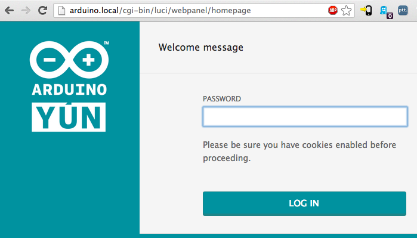
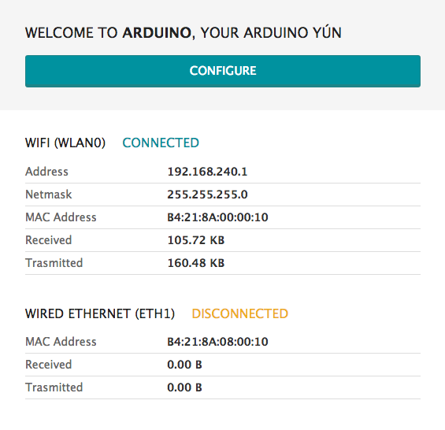
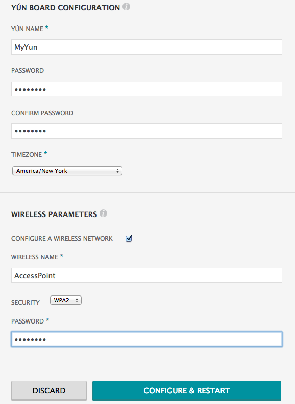

#####连接网络

出厂时，Arduino Yun 默认为Ap模式，你需要用电脑或者手机通过wifi连接你的Arduino Yun。其ssid名字的格式为`ArduinoYun-XXXXXXXXXXXX`，
打开浏览器，在地址栏输入`http://arduino.local`或者`192.168.240.1`，按下`Enter`后会看到以下网页。

登录密码框中输入`arduino`（ArduinoYun默认登录密码为`arduino`），点击`LOG IN`进入以下页面，该页面展示Arduino Yun当前的网络信息。

点击`CONFIGURE`进入配置页面，如下

在`WIRELESS NAME` 中输入你想要的连接的wifi名称，`SECURITY` 中选择加密方式，`PASSWORD`中输入wifi密码，点击`CONFIGURE & RESTART`,Arduino Yun会自动重启并连接你所配置的网络。

	
#####获取ArduinoYun的IP

利用`SSH`登录Arduino Yun需要获取Arduino Yun的IP，可以直接登录路由获取，也可以用`Arduino 1.6.6`或者以上版本的IDE获取。将Arduino Yun保持上电，打开`Arduino IDE`，选择`工具-->端口`如下图：

	
#####SSH登录ArduinoYun

`SecureCRT`自带文件传输工具，这里以`SecureCRT`为例。打开`SecureCRT`，选择`file-->Quick Connect`，在`Hostname`框中输入Arduino Yun的IP，`name`输入`root`，如下图：

点击`Connect`后弹出下图，输入密码登录`arduino`（默认），进入以下界面说明`SSH`登录成功。

